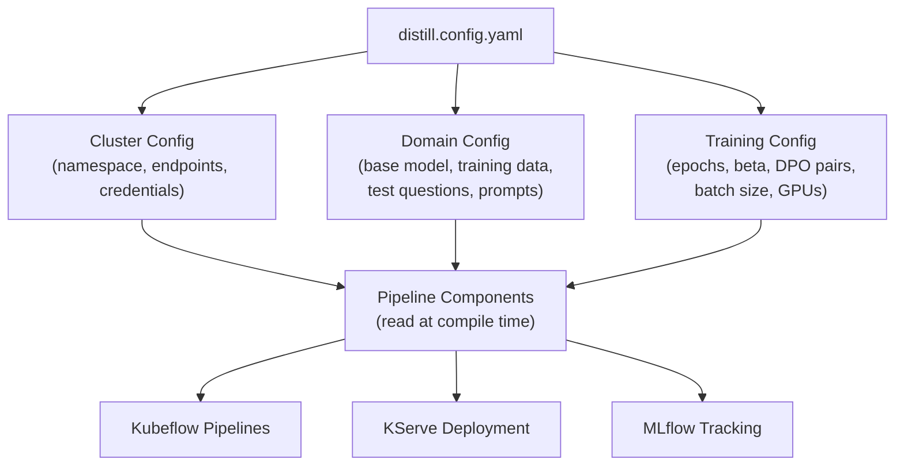
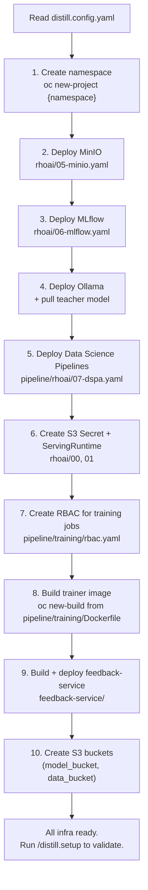

# Distillation Agent Skill (Reusable)

## Goal

Any developer with a **bare OpenShift cluster** (no ML infra installed) should be able to:
1. Clone this repo
2. Fill out `distill.config.yaml` (namespace, domain, hyperparams)
3. Run `/distill.prerequisites` to install all ML infrastructure
4. Run `/distill.setup` to validate everything is healthy
5. Run `/distill.run` to fine-tune an SLM for their use case

No code changes needed. Config + slash commands only.

## Architecture: Config-Driven Design

The key to reusability is a single config file (`distill.config.yaml`) that separates three concerns:



## distill.config.yaml Template

```yaml
# ============================================================
# CLUSTER CONFIG -- your OpenShift AI environment
# ============================================================
cluster:
  namespace: "my-namespace"
  s3_endpoint: "http://minio.my-namespace.svc.cluster.local:9000"
  s3_access_key: "minioadmin"
  s3_secret_key: "minioadmin123"
  mlflow_uri: "http://mlflow.my-namespace.svc.cluster.local:5000"
  mlflow_experiment: "Distillation-Eval"
  model_bucket: "my-models"           # S3 bucket for trained models
  data_bucket: "mlflow-artifacts"     # S3 bucket for training data + preferences

# ============================================================
# TEACHER CONFIG -- the large model that teaches the student
# ============================================================
teacher:
  api_url: "http://ollama.my-namespace.svc.cluster.local:11434"
  model: "qwen2.5-coder:32b-instruct-q4_K_M"
  api_key: ""                         # leave empty for Ollama
  system_prompt: >-
    You are a senior code reviewer specializing in Go, Python,
    and Kubernetes. Be concise -- 2-4 sentences max.

# ============================================================
# STUDENT CONFIG -- the small model being fine-tuned
# ============================================================
student:
  base_model_id: "Qwen/Qwen2.5-Coder-1.5B-Instruct"
  model_prefix: "code-review-1.5b-"   # versions: code-review-1.5b-v1, v2...
  isvc_name: "code-review-llm"        # KServe InferenceService name

# ============================================================
# DOMAIN CONFIG -- what the model is being trained to do
# ============================================================
domain:
  name: "code-review"
  training_data_prefix: "synthetic/code-review/"  # S3 prefix for JSONL
  question_bank_s3: "s3://mlflow-artifacts/synthetic/code-review/diff-bank.json"
  
  # 10-15 curated test prompts for evaluation (domain-specific)
  test_questions:
    - "Review this code diff: ..."
    - "Review this code diff: ..."
  
  # How the teacher grades student responses
  grading_prompt: >-
    You are grading an AI-generated response. Rate it 1-10.
    Scoring guide:
    - 8-10: Correctly identifies the main issue(s). Bonus if concise.
    - 6-7: Identifies the issue but verbose or missing details.
    - 4-5: Partially correct.
    - 2-3: Mostly wrong or hallucinated.
    - 1: Completely irrelevant.
    Respond with ONLY: {"score": <number>, "reason": "<brief>"}

# ============================================================
# TRAINING CONFIG -- hyperparameters
# ============================================================
training:
  sft_epochs: 3
  dpo_epochs: 1
  dpo_beta: 0.3
  min_dpo_pairs: 3
  max_supplement_questions: 5
  static_bank_sample_size: 300
  sft_mix_ratio: 0.15
```

## Commands

```
/distill.prerequisites   # Install ALL infra on a bare cluster (MinIO, MLflow, Ollama, KFP, KServe, trainer image)
/distill.setup           # Validate config, health-check all services, create S3 buckets
/distill.run             # Full pipeline: compile, upload, trigger
/distill.run --name "Run 5"  # Custom run name
/distill.status          # Current run state, GPU nodes, model version, KServe health
/distill.eval            # Trigger evaluation on currently deployed model
/distill.baseline        # Run baseline eval on untuned base model
/distill.deploy v3       # Deploy specific model version to KServe
/distill.feedback        # Show pending/used human feedback DPO pairs
/distill.scores          # MLflow score trend across all runs
/distill.portforward     # Set up port-forwards (model:8080, MinIO:9100)
```

## /distill.prerequisites -- Full Infra Bootstrap (Brand New Cluster)

This is the big one. A developer with nothing but a bare OpenShift cluster and `oc login` runs this, and the agent installs everything. It uses the existing manifests in `rhoai/` templatized with the namespace from config.

**Existing manifests that already define everything needed:**

- [rhoai/05-minio.yaml](rhoai/05-minio.yaml) -- PVC + Deployment + Secret + Service + Route (MinIO)
- [rhoai/06-mlflow.yaml](rhoai/06-mlflow.yaml) -- Secret + PVC + Deployment + Service + Route (MLflow)
- [rhoai/00-s3-secret.yaml](rhoai/00-s3-secret.yaml) -- S3 Secret + ServiceAccount for KServe
- [rhoai/01-serving-runtime-vllm.yaml](rhoai/01-serving-runtime-vllm.yaml) -- vLLM ServingRuntime
- [rhoai/02-inference-service-student.yaml](rhoai/02-inference-service-student.yaml) -- KServe InferenceService
- [pipeline/rhoai/07-dspa.yaml](pipeline/rhoai/07-dspa.yaml) -- DataSciencePipelinesApplication (Kubeflow Pipelines)
- [pipeline/training/rbac.yaml](pipeline/training/rbac.yaml) -- Role + RoleBinding for training jobs
- [pipeline/training/Dockerfile](pipeline/training/Dockerfile) -- Trainer image (PyTorch + TRL + PEFT)
- [feedback-service/k8s/deployment.yaml](feedback-service/k8s/deployment.yaml) -- Feedback API (Deployment + Service + Route)
- [feedback-service/Dockerfile](feedback-service/Dockerfile) -- Feedback API image

**What `/distill.prerequisites` does step-by-step:**



**Step details:**

1. **Create namespace** -- `oc new-project {config.cluster.namespace}` (skip if exists)
2. **Deploy MinIO** -- sed namespace into `rhoai/05-minio.yaml`, apply. Wait for pod Ready.
3. **Deploy MLflow** -- sed namespace into `rhoai/06-mlflow.yaml`, apply. Wait for pod Ready.
4. **Deploy Ollama** -- create Deployment + Service for Ollama (GPU-enabled), then `curl /api/pull` to download the teacher model specified in config. This is the only manifest not in `rhoai/` yet -- the agent creates it from a template.
5. **Deploy DSPA** -- apply `pipeline/rhoai/07-dspa.yaml`. This installs Kubeflow Pipelines.
6. **Create KServe resources** -- apply `rhoai/00-s3-secret.yaml` (S3 credentials for KServe) and `rhoai/01-serving-runtime-vllm.yaml` (vLLM runtime).
7. **Create RBAC** -- apply `pipeline/training/rbac.yaml` for PyTorchJob permissions.
8. **Build trainer image** -- `oc new-build` using `pipeline/training/Dockerfile`, push to internal registry. Wait for build to complete.
9. **Build + deploy feedback-service** -- `oc new-build` from `feedback-service/Dockerfile`, then apply `feedback-service/k8s/deployment.yaml`.
10. **Create S3 buckets** -- use boto3 to create `config.cluster.model_bucket` and `config.cluster.data_bucket` in MinIO.

Each step is **idempotent** -- if the resource already exists, skip it. The agent reports progress for each step.

**What the user needs BEFORE running `/distill.prerequisites`:**
- An OpenShift cluster with `oc login` access (cluster-admin or namespace-admin)
- GPU nodes available (MachineSets already scaled -- the skill does NOT provision cloud infrastructure)
- The RHOAI operator installed (provides KServe + DSPA CRDs)

## /distill.setup -- Health Check and Validation

After prerequisites are installed (or if infra already exists), `/distill.setup` validates everything:

1. Reads `distill.config.yaml`
2. `oc whoami` -- logged in?
3. `oc get namespace {namespace}` -- exists?
4. MinIO reachable -- test S3 connection via port-forward + boto3
5. MLflow reachable -- `curl {mlflow_uri}/api/2.0/mlflow/experiments/list`
6. Ollama reachable -- `curl {teacher.api_url}/api/tags`, verify teacher model is pulled
7. KFP installed -- `oc get route ds-pipeline-dspa -n {namespace}`
8. GPU nodes -- `oc get nodes -l nvidia.com/gpu.present=true`, count GPUs
9. Trainer image exists -- `oc get imagestream distillation-trainer -n {namespace}`
10. KServe ready -- `oc get servingruntime -n {namespace}`
11. S3 buckets exist with required prefixes
12. Reports health status for each component (PASS/FAIL)

If everything passes: "All systems healthy. Run `/distill.run` to start training."

## How the Pipeline Reads Config

Currently, [code_review_pipeline.py](pipeline/code_review_pipeline.py) has hardcoded constants (lines 37-50). The change:

- Add a `load_config()` function that reads `distill.config.yaml` from the repo root
- Replace all hardcoded constants with values from the config dict
- `TEST_QUESTIONS` moves from the Python file into the YAML config (or a separate file the config points to)
- Pipeline compile step reads config at compile time, bakes values into the YAML

This means the pipeline components themselves stay generic -- only the pipeline definition file and eval scripts change.

## Files to Modify

- [pipeline/code_review_pipeline.py](pipeline/code_review_pipeline.py) -- replace hardcoded constants with `load_config()`, move TEST_QUESTIONS to config
- [pipeline/components/evaluate.py](pipeline/components/evaluate.py) -- accept `grading_prompt` as a parameter instead of hardcoding it
- [pipeline/scripts/baseline_eval.py](pipeline/scripts/baseline_eval.py) -- read config for endpoints, model ID, grading prompt, test questions
- [rhoai/05-minio.yaml](rhoai/05-minio.yaml) -- templatize namespace (or use sed at apply time)
- [rhoai/06-mlflow.yaml](rhoai/06-mlflow.yaml) -- templatize namespace
- [rhoai/00-s3-secret.yaml](rhoai/00-s3-secret.yaml) -- templatize namespace + credentials from config
- [feedback-service/k8s/deployment.yaml](feedback-service/k8s/deployment.yaml) -- templatize namespace + env vars from config

## Files to Create

- `distill.config.yaml` -- the config template (checked in with code-review example values + comments)
- `.cursor/skills/distill/SKILL.md` -- the Skill definition with all commands
- `rhoai/04-ollama.yaml` -- Ollama Deployment + Service manifest (currently created ad-hoc, needs to be a checked-in template)

## Example: Adapting for Log Analysis

A developer wanting to fine-tune an SLM for Kubernetes log analysis would:

1. Clone the repo
2. Edit `distill.config.yaml`:
   - `student.base_model_id`: `"Qwen/Qwen2.5-1.5B-Instruct"` (general, not coder)
   - `student.model_prefix`: `"log-analyzer-1.5b-"`
   - `student.isvc_name`: `"log-analyzer-llm"`
   - `domain.name`: `"log-analysis"`
   - `domain.training_data_prefix`: `"synthetic/log-analysis/"`
   - `domain.test_questions`: 15 log snippets with known issues
   - `domain.grading_prompt`: criteria for log analysis quality
   - `teacher.system_prompt`: "You are a senior SRE analyzing Kubernetes logs..."
3. Upload training JSONL to `s3://{data_bucket}/synthetic/log-analysis/`
4. Run `/distill.setup` then `/distill.run`

Zero code changes. Same pipeline, different config.

## What Stays the Same Across Domains

- All 9 pipeline components (resolve_version, finetune, extract_preferences, etc.)
- The PyTorchJob / QLoRA training logic
- KServe deployment logic
- MLflow tracking
- Human feedback loop (extension + feedback API)
- The iterative checkpoint-chaining (each run starts from the previous)
- GPU auto-discovery and scaling
