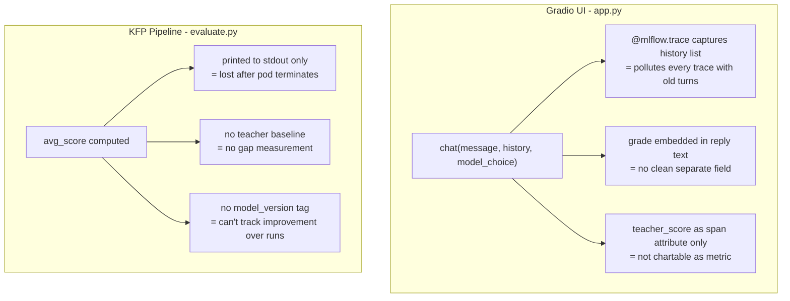
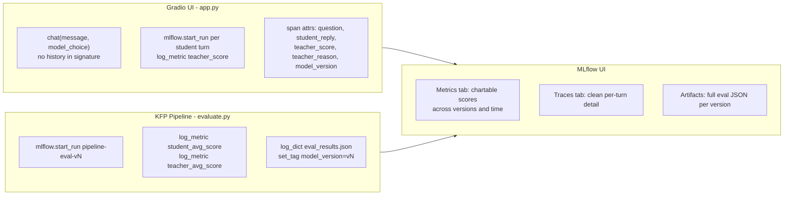

# Fix Evaluation and MLflow Tracing

## Current Problems




## Target State




## Changes

### 1. `[app.py](app.py)` — Fix UI tracing (3 changes)

**Problem 1: history pollutes traces.**
`chat()` accepts `history: list` but never uses it in the function body. MLflow captures all args, so every trace shows the full prior conversation.

- Remove `history` from `chat()` signature entirely
- Update the `respond()` wrapper to call `chat(message, model_choice)`

**Problem 2: grade has no separate MLflow field / not chartable.**
Currently `teacher_score` is only a trace span attribute — not a metric. Add `mlflow.start_run()` in the student branch to log it as a proper metric:

```python
with mlflow.start_run(run_name=f"student-turn-{int(time.time())}",
                       tags={"model_version": MODEL_VERSION, "turn_type": "student"}):
    mlflow.log_metric("teacher_score", score)
    mlflow.log_param("question", message[:500])
    mlflow.log_param("teacher_reason", reason)
```

**Problem 3: no model version.**
Add `MODEL_VERSION = os.getenv("MODEL_VERSION", "unknown")` and include it in both span attributes and run tags.

The grade suffix in Gradio chat display stays (`**Grade: 7/10`**) — that's useful UX. It just won't pollute the trace anymore since history is removed.

---

### 2. `[pipeline/components/evaluate.py](pipeline/components/evaluate.py)` — Log to MLflow

Add two new params: `mlflow_tracking_uri: str`, `model_version: str`.

Add `mlflow` to `packages_to_install`.

After computing student scores, also query Teacher on the same questions to get a baseline. Then open a proper MLflow run:

```python
mlflow.set_tracking_uri(mlflow_tracking_uri)
mlflow.set_experiment("Distillation-Eval-Hub")
with mlflow.start_run(run_name=f"pipeline-eval-{model_version}"):
    mlflow.set_tag("model_version", model_version)
    mlflow.set_tag("eval_type", "pipeline_benchmark")
    mlflow.log_metric("student_avg_score", student_avg)
    mlflow.log_metric("teacher_avg_score", teacher_avg)
    mlflow.log_metric("score_gap", teacher_avg - student_avg)
    for i, r in enumerate(results):
        mlflow.log_metric(f"q{i+1}_student_score", r["student_score"])
        mlflow.log_metric(f"q{i+1}_teacher_score", r["teacher_score"])
    mlflow.log_dict({"results": results}, "eval_results.json")
```

This gives you: a chart of `student_avg_score` vs `teacher_avg_score` across v1, v2, v3... in MLflow's Compare Runs view.

---

### 3. `[pipeline/pipeline.py](pipeline/pipeline.py)` — Pass new params to evaluate

`version_task.outputs["version"]` already exists (returns e.g. `"v11"`). Just pass it through:

```python
eval_task = evaluate(
    student_url=deploy_task.output,
    groq_api_key=groq_api_key,
    groq_model=groq_model,
    test_questions=TEST_QUESTIONS,
    mlflow_tracking_uri=MLFLOW_URI,          # new
    model_version=version_task.outputs["version"],  # new
)
```

## What You'll See in MLflow After This

- **Metrics tab (Runs view):** Chart showing `student_avg_score` and `teacher_avg_score` across pipeline runs, with `score_gap` shrinking as distillation improves
- **Traces tab:** Clean single-turn traces — `question`, `student_reply`, `teacher_score`, `teacher_reason`, `model_version` — no history pollution
- **Artifacts:** `eval_results.json` per pipeline run with full per-question breakdown
- **Tags:** Filter by `model_version=v11` or `eval_type=pipeline_benchmark`

## Files Changed

- `[app.py](app.py)`
- `[pipeline/components/evaluate.py](pipeline/components/evaluate.py)`
- `[pipeline/pipeline.py](pipeline/pipeline.py)`

