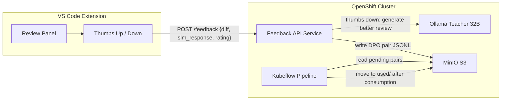

# Human-in-the-Loop DPO Feedback System

## Architecture



## Data Flow

1. User gets a code review from the SLM in the extension
2. User clicks thumbs down (bad review) or thumbs up (good review)
3. **Thumbs down**: Extension sends `{diff, slm_response}` to the Feedback API. The API calls the Ollama teacher to generate a better review, then writes a DPO pair to MinIO at `preferences/human-feedback/pending/fb-{timestamp}-{uuid}.jsonl`
4. **Thumbs up**: Extension sends the same payload. The API stores it as a positive signal (no DPO pair needed -- the SLM is already correct). Stored at `feedback/positive/` for future analysis
5. During the next pipeline run, `extract_preferences.py` reads all files under `preferences/human-feedback/pending/`, appends them to the DPO pair set, then **moves each consumed file** to `preferences/human-feedback/used/` so it is never reused

## DPO Pair Format (same as existing pipeline)

```json
{"prompt": "<the git diff>", "chosen": "<teacher review>", "rejected": "<SLM review>", "source": "human_feedback", "score_gap": null}
```

---

## Component 1: Feedback API Service (new)

A lightweight FastAPI app deployed as a single-pod Deployment on the cluster.

- **Endpoint**: `POST /feedback`
  - Body: `{"diff": "...", "slm_response": "...", "rating": "down"|"up"}`
  - On `down`: calls Ollama teacher (`/api/chat`) with the diff, gets a better review, writes a DPO pair JSONL to MinIO under `preferences/human-feedback/pending/`
  - On `up`: writes to `feedback/positive/` for tracking (no DPO pair)
  - Returns `{"status": "ok", "teacher_response": "..."}` so the extension can optionally show the improved review
- **Config**: Ollama URL, MinIO credentials, teacher model name -- all via environment variables / ConfigMap
- **Deployment**: Single replica, no GPU needed, tiny resource footprint (`100m` CPU, `256Mi` memory)
- New file: `feedback-service/app.py` (~80 lines)
- New file: `feedback-service/Dockerfile`
- New file: `feedback-service/k8s/deployment.yaml` (Deployment + Service + Route)

## Component 2: VS Code Extension Changes

Files to modify: [extension/src/panel.ts](extension/src/panel.ts), [extension/src/extension.ts](extension/src/extension.ts), [extension/package.json](extension/package.json)

- **panel.ts**: Add thumbs-up/down buttons to the webview HTML below the review content. Wire `postMessage` back to the extension host when clicked.
- **extension.ts**: Handle `onDidReceiveMessage` for `{type: "feedback", rating: "up"|"down"}`. Send HTTP POST to the configured feedback API URL with the current diff and SLM response.
- **package.json**: Add new configuration `localReviewer.feedbackApiUrl` (default: `http://feedback-api.sridharproject.svc.cluster.local:8000` for in-cluster, or the Route URL for external access).

## Component 3: Pipeline Changes

File to modify: [pipeline/components/extract_preferences.py](pipeline/components/extract_preferences.py)

Add a **new Source C** block after the existing Source A (MLflow eval) and Source B (question bank):

```
SOURCE C: Human feedback from extension
```

- List all objects under `preferences/human-feedback/pending/` in MinIO
- For each file: read JSONL, append pairs to `preference_pairs` list
- After all pending files are read, **move each file** to `preferences/human-feedback/used/{same filename}` (S3 copy + delete)
- This guarantees each human feedback pair is consumed exactly once
- Log how many human feedback pairs were added

## "Used Once" Guarantee

The move-after-consume pattern ensures:
- Pending pairs sit in `pending/` until a pipeline run picks them up
- The pipeline reads them, adds to DPO training, then atomically moves to `used/`
- Next run finds `pending/` empty (or with only newer feedback)
- `used/` serves as an audit trail if you ever need to inspect historical feedback

---

## Summary of Changes

- **New**: `feedback-service/` directory (FastAPI app + Dockerfile + K8s manifests)
- **Modified**: `extension/src/panel.ts` (add thumbs buttons + message handler)
- **Modified**: `extension/src/extension.ts` (handle feedback messages, POST to API)
- **Modified**: `extension/package.json` (new `feedbackApiUrl` config)
- **Modified**: `pipeline/components/extract_preferences.py` (Source C: human feedback)
- **Modified**: `pipeline/code_review_pipeline.py` (no changes needed -- pairs flow through existing `pref_task.output`)
