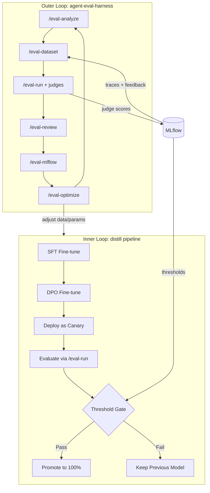

# Implementing Antonin's Agentic Continual Learning Vision

## Sources

- [agent-eval-harness README](https://github.com/opendatahub-io/agent-eval-harness) -- the actual framework, its `eval.yaml` format, judge types, and 7-skill pipeline
- [Antonin's notes](docs/knowledge-base/AgenticPoc/antonin-agent-eval.md) -- what he explicitly asked for
- [Architecture doc](docs/knowledge-base/AgenticPoc/antonin-continual-learning-architecture.md) -- the two-loop continual learning reference architecture

## What Antonin Wants (Summary)

- **Use agent-eval-harness** as the evaluation backbone (not a custom judge framework)
- **Structured judges** replacing the single monolithic grading prompt (Gap #3 -- Sri explicitly named)
- **Eval-gated deployment** -- no model goes live unless it passes harness thresholds
- **KServe canary/traffic splitting** -- A/B test model versions (Alex's point, Antonin endorsed)
- **Skills as Kubeflow pipeline components** -- each `/eval-`* skill becomes a KFP step
- **Unified outer + inner loop** -- harness `eval-optimize` wraps distill pipeline
- **MLflow as the shared data plane** -- traces, annotations, datasets, model registry

## Architecture: Two-Loop System




**Sri's pipeline IS the inner loop.** The harness provides the outer loop and the structured judge framework.

---

## Phase 1: Agent-Eval-Harness Integration + Structured Judges

**Why first:** This is the core of what Antonin wants -- use HIS framework, not a custom reimplementation. The harness already provides inline `check` judges, LLM `prompt` judges, threshold-based regression detection, and MLflow integration. We adopt it directly.

### Step 1a: Install the harness

```bash
git clone https://github.com/opendatahub-io/agent-eval-harness
pip install -e ./agent-eval-harness
and if needed do 
claude --plugin-dir ./agent-eval-harness
This makes all eval skills available: /eval-setup, /eval-analyze, /eval-dataset, /eval-run, /eval-review, /eval-mlflow, and /eval-optimize.
```


The harness provides the Python package `agent_eval` (config loading, `EvalRunner` ABC, MLflow integration) and the 7 skills (`/eval-setup` through `/eval-optimize`).

### Step 1b: Create `eval/eval.yaml` for code review

This follows the ACTUAL harness format from the repo (see `eval.yaml`, `config.py`):

```yaml
name: code-review-slm-eval
description: Evaluate the distilled code review SLM against structured judges
skill: distill-code-review

execution:
  mode: case
  arguments: "{diff}"

runner:
  type: openai-compatible       # NEW runner we'll add (see Step 1d)

models:
  skill: code-review-llm        # the student model (KServe endpoint)
  judge: qwen2.5-coder:32b      # teacher model for LLM judges (Ollama)

mlflow:
  experiment: CodeReview-Eval-Hub
  tracking_uri: http://mlflow.sridharproject.svc.cluster.local:5000

dataset:
  path: eval/dataset/cases
  schema: |
    Each case directory contains:
    - input.yaml: YAML file with 'diff' (the code diff to review),
      'category' (bug/security/performance/kubernetes/reliability/
      style/clean), and 'expected_behavior' (what a correct review
      should identify, or 'clean' if no issues).
    - reference.md: Gold standard review from the teacher model.
    - annotations.yaml: Expected scores and metadata (has_bug: bool,
      expected_issues: list).

outputs:
  - path: artifacts
    schema: |
      One text file per case containing the student model's
      code review response.

traces:
  metrics: true
  stdout: true

judges:
  # Judge 1: Correctness (inline check -- no LLM needed)
  - name: correctness
    description: |
      Does the review correctly identify the issue type? If the diff
      has a bug and the review finds it, pass. If the diff is clean
      and the review says LGTM, pass. If either is wrong, fail.
    check: |
      review = outputs["main_content"].lower()
      annotations = outputs.get("annotations", {})
      has_bug = annotations.get("has_bug", True)
      if has_bug:
          lgtm_phrases = ["lgtm", "looks good", "no issues", "clean code"]
          if any(p in review for p in lgtm_phrases):
              return False, "Review missed a real bug (said LGTM)"
          return True, "Review identified an issue in buggy code"
      else:
          hallucination_words = ["bug", "vulnerability", "injection", "error", "fix"]
          flagged = [w for w in hallucination_words if w in review]
          if flagged and "no " not in review:
              return False, f"Hallucinated issues in clean code: {flagged}"
          return True, "Correctly identified clean code"

  # Judge 2: Conciseness (inline check -- no LLM needed)
  - name: conciseness
    description: |
      Is the review concise? Under 200 words is ideal for a PR comment.
    check: |
      review = outputs["main_content"]
      word_count = len(review.split())
      if word_count <= 200:
          return True, f"Concise ({word_count} words)"
      elif word_count <= 400:
          return False, f"Verbose ({word_count} words, target <200)"
      else:
          return False, f"Far too verbose ({word_count} words)"

  # Judge 3: Quality (LLM judge -- uses teacher model)
  - name: review_quality
    description: |
      Is the review actionable, specific, and relevant to the diff?
      Score 1-5 where 5 is a perfect PR review comment.
    prompt: |
      You are evaluating an AI-generated code review comment.
      The code diff and the review are provided.

      Score the review 1-5:
      5: Correctly identifies the key issue, suggests a fix, concise
      4: Identifies the issue but could be more specific or actionable
      3: Partially relevant but misses important details
      2: Mostly wrong or addresses the wrong concern
      1: Completely irrelevant or nonsensical

      If the code is genuinely clean and the review says so, that is
      correct and scores 4-5.

      Respond with ONLY a number 1-5.

  # Judge 4: Regression check (inline -- compares against baseline)
  - name: regression_check
    description: |
      Verify the model hasn't regressed vs the baseline score stored
      in MinIO at baseline/scores.json.
    check: |
      annotations = outputs.get("annotations", {})
      baseline_score = annotations.get("baseline_score")
      current_score = annotations.get("current_composite")
      if baseline_score is None or current_score is None:
          return True, "No baseline available, skipping regression check"
      if current_score >= baseline_score * 0.95:
          return True, f"No regression ({current_score:.2f} >= {baseline_score:.2f} * 0.95)"
      return False, f"Regression detected ({current_score:.2f} < {baseline_score:.2f} * 0.95)"

thresholds:
  correctness:
    min_pass_rate: 0.7
  conciseness:
    min_pass_rate: 0.8
  review_quality:
    min_mean: 3.5
  regression_check:
    min_pass_rate: 1.0
```

### Step 1c: Convert test cases to harness format

Current: [pipeline/domain/test_questions.json](pipeline/domain/test_questions.json) has 15 test cases with `category` and `question` fields.

Target: `eval/dataset/cases/` directory with one subdirectory per case:

```
eval/dataset/cases/
  case-001-go-cacrt-bug/
    input.yaml          # diff, category, expected_behavior
    reference.md        # teacher's gold-standard review
    annotations.yaml    # has_bug: true, expected_issues: ["error wrapping lost"]
  case-002-python-token-bug/
    input.yaml
    reference.md
    annotations.yaml
  ...
  case-014-clean-featuregate/
    input.yaml
    reference.md
    annotations.yaml    # has_bug: false
```

Each `input.yaml`:

```yaml
diff: |
  File: pkg/controller/job_controller.go
  Language: Go
  ...the diff content...
category: bug
expected_behavior: "Error wrapping lost -- fmt.Errorf uses %w but err is nil in that branch"
```

Each `annotations.yaml`:

```yaml
has_bug: true
expected_issues:
  - "error wrapping lost"
  - "nil err used with %w"
```

We generate `reference.md` by running the teacher (Ollama) on each diff and capturing its response.

### Step 1d: Add OpenAI-compatible EvalRunner

The harness has `EvalRunner` ABC in `agent_eval/agent/base.py` with `claude_code.py` as the only implementation. We add a new runner for OpenAI-compatible endpoints (vLLM/KServe):

- NEW: `agent_eval/agent/openai_compatible.py` -- subclass of `EvalRunner`
- Sends the diff to the student model's `/v1/chat/completions` endpoint
- Collects the response as the output artifact
- Registers in the `RUNNERS` dict

This is the key bridge between the harness (designed for Claude Code) and our KServe-deployed student model.

### Step 1e: Modify evaluate.py to use the harness

Replace the monolithic grading in [pipeline/components/evaluate.py](pipeline/components/evaluate.py) with:

1. Load `eval.yaml` via `EvalConfig.from_yaml()`
2. Instantiate the `openai-compatible` runner pointing at the student's KServe URL
3. Run each case through the runner, collect outputs
4. Score with all 4 judges using the harness's `score.py` logic
5. Log per-judge results to MLflow via `/eval-mlflow` integration
6. Return structured results with per-judge breakdowns

The current `GRADING_PROMPT` and `teacher_grade()` function are replaced by the harness judge framework.

**Files changed:**

- NEW: `eval/eval.yaml`
- NEW: `eval/dataset/cases/case-NNN-*/input.yaml, reference.md, annotations.yaml` (15 cases)
- NEW: `eval/prompts/quality-judge.md` (optional, for prompt_file-based judge)
- NEW: `agent_eval/agent/openai_compatible.py` (contributed back to harness or kept local)
- MODIFY: [pipeline/components/evaluate.py](pipeline/components/evaluate.py)
- MODIFY: [pipeline/domain/test_questions.json](pipeline/domain/test_questions.json) -- add `expected_behavior` field
- MODIFY: [distill.config.yaml](distill.config.yaml) -- point to eval.yaml path

---

## Phase 2: Eval-Gated Deployment

**Key insight:** Currently the pipeline deploys the DPO model (Step 6) BEFORE evaluating it (Step 7). A bad model is already serving traffic. This must be reversed.

**Files to change:**

- NEW: `pipeline/components/quality_gate.py` -- Compare current judge scores vs harness thresholds
- MODIFY: [pipeline/code_review_pipeline.py](pipeline/code_review_pipeline.py) -- Reorder steps, add conditional deployment

**Revised pipeline flow:**

```
Steps 0-4: same (through DPO training)
Step 5: DPO fine-tune -> output saved to S3 (NOT deployed yet)
Step 6: Deploy DPO as TEMPORARY endpoint for evaluation
Step 7: Evaluate via harness judges (correctness, conciseness, quality, regression)
Step 8: Quality gate -- check harness thresholds:
        correctness min_pass_rate >= 0.7
        conciseness min_pass_rate >= 0.8
        review_quality min_mean >= 3.5
        regression_check min_pass_rate >= 1.0
Step 9a (all pass): Deploy DPO model to production endpoint
Step 9b (any fail): Skip deployment, log which thresholds failed, keep previous model
```

The `quality_gate` component:

- Reads the structured judge results from Step 7
- Checks each threshold from `eval.yaml`
- Loads previous best scores from MLflow (tagged `eval_type: pipeline_benchmark`)
- If ALL thresholds pass: output `"pass"`
- If ANY threshold fails: output `"fail"` with which judge failed and by how much
- Pipeline uses `dsl.Condition(gate_task.output == "pass")` to branch

---

## Phase 3: KServe Canary Deployment

**Why:** Instead of hard-swapping models (risky), deploy the DPO model as a canary with 10% traffic, evaluate under real conditions, then promote.

**Files to change:**

- MODIFY: [pipeline/components/deploy_model.py](pipeline/components/deploy_model.py) -- Add `canary_traffic_percent` parameter, use KServe `canaryTrafficPercent` spec field
- NEW: `pipeline/components/promote_canary.py` -- Promote canary to 100% traffic
- NEW: `pipeline/components/rollback_canary.py` -- Remove canary revision

**Flow with canary + eval gate:**

```
DPO train
  -> deploy as canary (canaryTrafficPercent: 10)
  -> run harness eval-run against canary endpoint
  -> quality gate (check thresholds)
  -> [pass] promote canary to 100%, remove old revision
  -> [fail] rollback canary, old model stays at 100%
```

KServe InferenceService patch for canary:

```yaml
spec:
  predictor:
    canaryTrafficPercent: 10
    model:
      storageUri: s3://sridhar-models/code-review-1.5b-v4-dpo/
```

---

## Phase 4: Wire Harness Skills as Kubeflow Pipeline Components

**What Antonin said:** "another thing is maybe integrate with pipelines? like everything skill could run in a pipeline"

Each harness skill (`/eval-analyze`, `/eval-dataset`, `/eval-run`, `/eval-mlflow`, `/eval-optimize`) maps to a KFP component. The skill logic stays the same but gets orchestrated by Kubeflow instead of being manually invoked.

**Files to change:**

- NEW: `pipeline/components/eval_run.py` -- KFP component wrapping `/eval-run`
- NEW: `pipeline/components/eval_mlflow.py` -- KFP component wrapping `/eval-mlflow`
- MODIFY: [pipeline/code_review_pipeline.py](pipeline/code_review_pipeline.py) -- Replace custom evaluate with harness components

**KFP component wrapping /eval-run:**

```python
@dsl.component(
    base_image="python:3.11-slim",
    packages_to_install=["agent-eval-harness", "mlflow", "pyyaml"],
)
def eval_run(
    eval_yaml_path: str,
    student_url: str,
    model_version: str,
) -> dict:
    """Run agent-eval-harness evaluation as a pipeline step."""
    from agent_eval.config import EvalConfig
    # Load config, run cases, score with judges, return results
    ...
```

This is the bridge between Antonin's "skills as pipeline components" and the existing Kubeflow pipeline.

---

## Phase 5: Eval-Optimize Loop

**What:** After evaluation reveals weaknesses, the harness's `/eval-optimize` skill analyzes judge failures, reads traces + rationale, and proposes fixes. In our context, "fixing the skill" means adjusting training parameters.

**Implementation:**

- `/eval-optimize` in the harness edits SKILL.md (prompts/instructions)
- For the distill pipeline, "optimizing" means adjusting `distill.config.yaml`:
  - Low correctness -> increase SFT epochs, add more labeled training pairs
  - Low conciseness -> increase DPO beta, add conciseness-focused DPO pairs
  - Low quality -> improve teacher system prompt
  - Regression -> reduce learning rate, revert checkpoint
- NEW: `pipeline/components/eval_optimize.py` -- Reads harness results, maps judge failures to config adjustments
- Logs structured recommendations to MLflow as a run artifact

**MLflow artifact example:**

```json
{
  "run_version": "code-review-1.5b-v4",
  "weakest_judge": "correctness",
  "correctness_pass_rate": 0.53,
  "threshold": 0.70,
  "recommendation": "increase_training_data",
  "suggested_actions": [
    "Add 50+ labeled bug/clean diff pairs with expected_behavior",
    "Increase SFT epochs from 3 to 5",
    "Add correctness-focused DPO pairs (correct review = chosen)"
  ],
  "auto_adjustable_params": {
    "training.sft_epochs": 5,
    "training.dpo_beta": 0.35
  }
}
```

---

## Phase 6: Full Outer Loop Automation (Aspirational)

**What:** The complete `eval-optimize -> retrain -> eval-run -> check` autonomous loop. This is the end-state from the architecture doc.

- A meta-pipeline ("continual learning pipeline") that:
  1. Runs `/eval-run` with harness judges against the current deployed model
  2. If thresholds fail, runs `/eval-optimize` to produce config adjustments
  3. Applies adjustments to `distill.config.yaml`
  4. Triggers a new distill pipeline run via Kubeflow API
  5. Waits for completion, runs `/eval-run` again
  6. Repeats until all thresholds pass or max iterations reached
  7. Logs convergence metrics to MLflow

This is stretch goal territory -- demonstrating Phases 1-4 already proves the architecture.

---

## What to Demo to Antonin

After Phases 1-3:

- "We're using agent-eval-harness directly -- same eval.yaml format, same judge types (inline `check` + LLM `prompt`), same thresholds."
- "The correctness judge catches when the model says LGTM on buggy code. The conciseness judge flags verbose responses. The quality judge uses the teacher for deeper assessment."
- "Harness thresholds gate deployment -- if correctness_pass_rate < 0.7, the model doesn't deploy. The canary gets rolled back."
- "Each eval run is logged to MLflow via /eval-mlflow. You can see per-judge breakdowns across model versions."
- "We contributed an OpenAI-compatible EvalRunner back to the harness for KServe/vLLM endpoints."

This directly demonstrates the inner loop of Antonin's reference architecture with eval-gated progression using HIS framework, and positions the PoC as a proof point for the unified outer+inner loop vision.