# Kubeflow Domain Fine-Tuning + DPO: Combined Plan

## Why This Order

```mermaid
flowchart LR
  subgraph phase1 [Phase 1: Domain Data + SFT]
    collect[Collect Kubeflow Sources] --> chunk[Chunk Documents]
    chunk --> qagen[Teacher Generates Q/A]
    qagen --> minio[Upload to MinIO]
    minio --> sft[Run Pipeline: SFT]
    sft --> eval1[Evaluate with KF Questions]
  end
  subgraph phase2 [Phase 2: DPO]
    eval1 --> prefs["Preference Data Available"]
    prefs --> dpo_code[Build DPO Components]
    dpo_code --> pipeline[Update Pipeline DAG]
    pipeline --> run2["Run Pipeline: SFT + DPO"]
    run2 --> eval2[Evaluate Again]
  end
```




DPO refines what SFT teaches. If SFT has no Kubeflow knowledge, DPO preference pairs won't cover Kubeflow either. Domain data first gives SFT the knowledge, then DPO sharpens it.

---

## Phase 1: Kubeflow Domain Data + SFT Baseline

### Step 1.1 — Source Collector: `scripts/kubeflow_sources.py`

Crawls four source types into `data/raw_sources.jsonl`:

- **Kubeflow docs site** — parse sitemap at `kubeflow.org/sitemap.xml`, fetch pages, strip HTML with `beautifulsoup4`
- **GitHub repos** — use GitHub API (or raw URLs) for READMEs, `docs/` markdown files, and release notes from: `kubeflow/pipelines`, `kubeflow/training-operator`, `kserve/kserve`, `kubeflow/katib`, `kubeflow/model-registry`, `kubeflow/manifests`, `kubeflow/notebooks`
- **Release notes** — GitHub Releases API, last ~10 per repo
- **YouTube transcripts** — `youtube-transcript-api` for curated KubeCon / community talks

Each line: `{url, project, doc_type, title, content}`

### Step 1.2 — Chunker: `scripts/chunk_sources.py`

Splits each doc into ~800-token overlapping chunks (200-token overlap). Uses `tiktoken` for token counting. Outputs `data/chunks.jsonl` with `{chunk_id, source_url, project, doc_type, title, chunk_text}`.

### Step 1.3 — Grounded Q&A Generator: `scripts/generate_kubeflow_qa.py`

For each chunk, sends it as context to Groq teacher with a system prompt that requires answers to be grounded in the passage. Generates 3-5 Q&A pairs per chunk. Formats as `{instruction, output, text}` (same schema as existing [scripts/generate_synthetic_gold.py](scripts/generate_synthetic_gold.py)). Uploads to MinIO under `synthetic/kubeflow/date=YYYY-MM-DD/`.

The existing pipeline's [extract_gold_data](pipeline/components/extract_gold.py) already reads everything under `synthetic/` -- zero pipeline changes needed.

### Step 1.4 — Question Bank: `scripts/kubeflow_question_bank.py`

Generates standalone questions by sub-project and topic (KFP SDK, TrainJob API, KServe canary, Katib algorithms, etc.). Teacher answers from parametric knowledge. Uploads to `synthetic/kubeflow-qbank/`. This script serves double duty — its question list is reused in Phase 2 for DPO preference collection.

### Step 1.5 — Quality Filter

Deduplicate by question similarity, drop pairs where the answer doesn't reference the source content, remove very short answers. This can be a pass in `generate_kubeflow_qa.py` or a separate `scripts/filter_qa.py`.

### Step 1.6 — Add Kubeflow Eval Questions

Update `TEST_QUESTIONS` in [pipeline/pipeline.py](pipeline/pipeline.py) (line 35) to include Kubeflow-domain questions:

```python
TEST_QUESTIONS = [
    # existing general questions...
    "What is a KFP component and how do you create one with the Python SDK?",
    "Explain the difference between PyTorchJob and TrainJob in the Training Operator.",
    "How does KServe handle canary deployments for ML models?",
    "What search algorithms does Katib support for hyperparameter tuning?",
    "How do you set up multi-tenancy in Kubeflow using profiles?",
]
```

### Step 1.7 — Run Pipeline (SFT Only)

Run the existing distillation pipeline. The extract step merges the new Kubeflow data with existing synthetic data. SFT trains on everything. Evaluate. This gives the **baseline score** for Kubeflow domain knowledge.

Expected data volume: ~5,000 Kubeflow Q&A pairs from ~1,240 chunks + ~500 from the question bank.

---

## Phase 2: DPO Pipeline Integration

Now the student has Kubeflow knowledge from SFT, and the evaluate step has produced `eval_results.json` with Kubeflow-specific teacher-vs-student comparisons.

### Step 2.1 — `extract_preferences.py` KFP Component

New file: [pipeline/components/extract_preferences.py](pipeline/components/extract_preferences.py)

Two data sources for preference pairs:

- **Source A (primary)**: Download `eval_results.json` from the previous pipeline run's MLflow artifact. Filter to entries where `student_score < teacher_score`. Map: `prompt=question`, `chosen=teacher_answer`, `rejected=student_answer`.
- **Source B (supplement)**: Query both Student and Teacher on a larger question set (reuse the Kubeflow question bank from Phase 1). Grade both, produce more pairs. This gives Kubeflow-specific preference data beyond the 5-10 eval questions.

Output: preference JSONL to MinIO at `s3://mlflow-artifacts/preferences/pref-{version}.jsonl`.

### Step 2.2 — DPO Training Mode in `finetune_job.py`

Modify [pipeline/training/finetune_job.py](pipeline/training/finetune_job.py) to support a `TRAINING_MODE` env var:

- `TRAINING_MODE=sft` (default): current behavior with `SFTTrainer`
- `TRAINING_MODE=dpo`: loads preference JSONL from `PREF_DATA_PATH`, uses `trl.DPOTrainer` + `DPOConfig`, loads SFT model from `BASE_MODEL_ID` (which now points to the SFT output on S3), `beta=0.1`, `learning_rate=5e-5`, `ref_model=None` (PEFT handles this)

Single image, single script, mode switch via env var.

### Step 2.3 — `dpo_finetune.py` KFP Component

New file: [pipeline/components/dpo_finetune.py](pipeline/components/dpo_finetune.py)

Same TrainJob pattern as [pipeline/components/finetune.py](pipeline/components/finetune.py). Differences: passes `TRAINING_MODE=dpo`, `PREF_DATA_PATH`, `DPO_BETA`, and uses the SFT model S3 path as `BASE_MODEL_ID`.

### Step 2.4 — Update Pipeline DAG

Modify [pipeline/pipeline.py](pipeline/pipeline.py) to insert two steps between SFT Fine-Tune (line 85) and Deploy (line 99):

```
Resolve Version -> Extract Gold -> SFT -> Extract Preferences -> DPO -> Deploy -> Evaluate
```

First-run handling: `extract_preferences` checks for a previous eval run in MLflow. If none exists, outputs empty file. `dpo_finetune` skips if fewer than `min_pairs` entries and passes through the SFT model path.

### Step 2.5 — Rebuild Docker Image

Rebuild [pipeline/training/Dockerfile](pipeline/training/Dockerfile) with updated `finetune_job.py` (DPO mode). Push as `v0.2.0`. Update image tag in the KFP component.

### Step 2.6 — Run Pipeline (SFT + DPO) and Compare

Run the updated pipeline. Compare eval scores against the Phase 1 baseline to measure DPO improvement. The Kubeflow eval questions specifically show whether DPO improved domain knowledge beyond SFT.

---

## Key Synergy Between the Two Phases

The Kubeflow question bank script (Phase 1, Step 1.4) feeds both:

- **SFT** — Q&A pairs uploaded to `synthetic/kubeflow-qbank/` as training data
- **DPO** — the question list is reused by `extract_preferences` Source B to generate Kubeflow-specific preference pairs

This means the effort to curate Kubeflow topics and questions pays off twice.

---

## New Dependencies

```
requests                 # HTTP fetching for docs/GitHub
beautifulsoup4           # HTML parsing for docs site
tiktoken                 # Token counting for chunking
youtube-transcript-api   # YouTube captions
```

All other deps (`boto3`, `groq`, `trl`, `peft`) already in `requirements.txt` / training Dockerfile.

---

## Files Changed or Created

Phase 1 (new scripts, no pipeline changes):

- `scripts/kubeflow_sources.py` — NEW
- `scripts/chunk_sources.py` — NEW
- `scripts/generate_kubeflow_qa.py` — NEW
- `scripts/kubeflow_question_bank.py` — NEW
- `scripts/filter_qa.py` — NEW (optional, can be inline)
- `pipeline/pipeline.py` — EDIT (add Kubeflow test questions to `TEST_QUESTIONS`)

Phase 2 (pipeline changes):

- `pipeline/components/extract_preferences.py` — NEW
- `pipeline/components/dpo_finetune.py` — NEW
- `pipeline/training/finetune_job.py` — EDIT (add DPO mode)
- `pipeline/training/Dockerfile` — EDIT (rebuild)
- `pipeline/pipeline.py` — EDIT (insert DPO steps in DAG, import new components)

