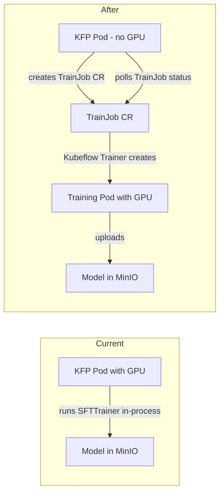

# Kubeflow Trainer Integration

## Current State

The finetune step in [pipeline/components/finetune.py](pipeline/components/finetune.py) runs QLoRA training **directly inside the KFP pod** using `set_gpu_limit(1)`. The cluster has the `TrainJob` CRD (`trainjobs.trainer.kubeflow.org` v1alpha1) available. The latest Kubeflow SDK is `**kubeflow` v0.3.0** (PyPI, Jan 2026) which depends on `kubeflow-trainer-api >= 2.0.0`.

## Architecture Change




## Files to Create

- `**pipeline/training/Dockerfile**` — Pre-built training image with all deps (PyTorch, peft, trl, bitsandbytes, etc.)
- `**pipeline/training/finetune_job.py**` — Standalone training script that reads config from env vars (extracted from current `finetune.py`)
- `**pipeline/training/rbac.yaml**` — Role + RoleBinding granting `pipeline-runner-dspa` SA permission to manage TrainJobs

## Files to Modify

- `**pipeline/components/finetune.py**` — Rewrite from "run training" to "submit TrainJob + poll until done" using the `kubernetes` Python client
- `**pipeline/pipeline.py**` — Remove `set_gpu_limit(1)`, `set_memory_*`, `set_cpu_*` from finetune_task (KFP pod no longer needs GPU)
- `**docs/executive-summary.md**` — Update components table: "Kubeflow Training Operator" becomes "Kubeflow Trainer" with accurate description

## Implementation Details

### 1. Training Image

Based on `pytorch/pytorch:2.5.1-cuda12.4-cudnn9-runtime` with all pip deps pre-installed. The entrypoint script (`finetune_job.py`) is the same QLoRA logic from the current component but reads params from environment variables:

- `GOLD_DATA_PATH`, `MODEL_OUTPUT_S3_PATH`, `BASE_MODEL_ID`, `NUM_EPOCHS`, `S3_ENDPOINT`, `S3_ACCESS_KEY`, `S3_SECRET_KEY`, `BATCH_SIZE`, `LEARNING_RATE`, `LORA_R`, `LORA_ALPHA`

Build: `docker buildx build --platform linux/amd64 -t quay.io/rh-ee-srpillai/distillation-trainer:v0.1.0 --push .`

### 2. Rewritten finetune KFP Component

The new component uses `kubernetes` Python client to:

1. Build a `TrainJob` manifest (apiVersion `trainer.kubeflow.org/v1alpha1`, kind `TrainJob`)
2. The TrainJob spec references the training image and passes all parameters as env vars
3. Submit via `CustomObjectsApi.create_namespaced_custom_object()`
4. Poll `get_namespaced_custom_object()` every 30s checking `.status.conditions` for `Succeeded` or `Failed`
5. Return `model_output_s3_path` on success, raise on failure

The component base image becomes `python:3.11-slim` with only `kubernetes` pip package (no GPU deps).

### 3. RBAC

Grant `pipeline-runner-dspa` SA in `sridharproject` permission to create/get/list/watch/delete `trainjobs` in the `trainer.kubeflow.org` API group.

### 4. Pipeline Changes in pipeline.py

Remove from finetune_task (lines 86-89):

```python
finetune_task.set_gpu_limit(1)
finetune_task.set_memory_request("16Gi")
finetune_task.set_memory_limit("24Gi")
finetune_task.set_cpu_request("4")
finetune_task.set_cpu_limit("8")
```

### 5. Recompile and Upload

```bash
cd pipeline/
python pipeline.py    # new distillation_flywheel.yaml
# Upload to RHOAI dashboard as DistillationFlywheel_4
```

Update the operator sample CR `pipelineName` to `DistillationFlywheel_4`.