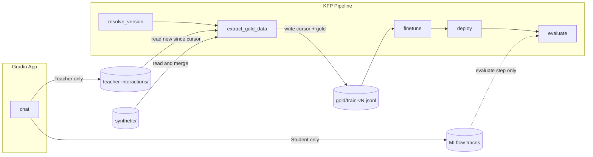

# Teacher in MinIO, Synthetic Data, and Incremental Extract Gold

## Goals

1. **Student** — Unchanged: interactions stored and evaluated in MLflow only.
2. **Teacher** — Stored only in MinIO under a dedicated path; pipeline reads from MinIO (no MLflow for teacher gold).
3. **Synthetic** — Stored in MinIO in an enterprise-friendly, scalable layout.
4. **extract_gold_data** — Reads teacher data from MinIO **incrementally** (only new interactions since last run), merges with synthetic, writes combined gold; updates a cursor so the next run continues from there.

---

## Data flow (high level)

- Teacher Q&A goes only to MinIO. Student Q&A and grading stay in MLflow.
- extract_gold_data reads from MinIO (teacher-interactions/ and synthetic/), not from MLflow.

---

## 1. MinIO layout (segregated, enterprise-ready)

Use a single bucket (e.g. `mlflow-artifacts` or a dedicated bucket) with clear prefixes:

| Prefix                              | Purpose                                        | Who writes                  | Who reads                       |
| ----------------------------------- | ---------------------------------------------- | --------------------------- | ------------------------------- |
| `teacher-interactions/`             | Teacher Q&A only; one object per interaction   | App (on each Teacher chat)  | extract_gold_data (incremental) |
| `teacher-interactions/.cursor.json` | Cursor for "last processed" (timestamp or key) | extract_gold_data           | extract_gold_data               |
| `synthetic/`                        | Synthetic Q&A; partitioned by date or run      | Standalone synthetic script | extract_gold_data               |
| `gold/`                             | Combined gold JSONL per run (`train-vN.jsonl`) | extract_gold_data           | finetune                        |

**Teacher interactions structure (recommended for scale):**

- Path pattern: `teacher-interactions/<date>/<timestamp>_<uuid>.json`  
Example: `teacher-interactions/2026-03-18/1731827123_abc123.json`  
Each object is one JSON: `{"instruction": "...", "output": "...", "text": "...", "timestamp": 1731827123}`.  
Date partitioning keeps listing and cursor logic simple and supports retention/compaction later.  
Alternative: flat `teacher-interactions/<timestamp>_<uuid>.json` if you prefer fewer prefixes.

**Synthetic data structure (enterprise, scalable):**

- Path pattern: `synthetic/date=YYYY-MM-DD/<run_id>.jsonl` or `synthetic/runs/<run_id>.jsonl`.  
Each run of the synthetic generator writes one JSONL file. Multiple runs accumulate; no overwrite.  
extract_gold_data can merge "all synthetic objects" or "since date" or "latest N runs" into the gold set.  
Recommendation: **date-partitioned** `synthetic/date=2026-03-18/run_<id>.jsonl` so you can add lifecycle/retention and reason about volume by day.

**Cursor for incremental teacher consumption:**

- Single object: `teacher-interactions/.cursor.json`  
Content: `{"last_processed_timestamp": 1731827123, "last_run_version": "v17"}` (or `last_processed_key` if you use key-based ordering).  
extract_gold_data reads it at start, lists only teacher objects "after" that cursor, merges them into gold, then updates the cursor and writes `gold/train-vN.jsonl`.

---

## 2. App: write Teacher interactions to MinIO only (no MLflow for training)

**File:** [app.py](app.py)

- When the user selects **Teacher** and gets a reply:
  - Keep logging the **student** path to MLflow as today (no change for student).
  - For **Teacher**: stop writing training data to MLflow for pipeline use; write **only to MinIO**.
- Add a small helper that uses boto3 (or env-configured S3 endpoint/creds) to upload one JSON object per Teacher Q&A to:
  - Key: `teacher-interactions/<date>/<timestamp>_<uuid>.json` (date from timestamp, uuid for uniqueness).
  - Body: `{"instruction": message, "output": reply, "text": "### Instruction:\n...\n\n### Response:\n...", "timestamp": <epoch>}`.
- Remove or repurpose `log_training_pair` so it no longer writes to local file or MLflow for teacher; call the new MinIO upload instead. Optionally keep a trace in MLflow for observability (trace only, not used by extract_gold).
- Ensure the app has MinIO endpoint and credentials (env vars); same bucket/prefix as the pipeline (e.g. `teacher-interactions/`).

Student path: keep `@mlflow.trace` and grading as-is; student interactions remain stored and evaluated in MLflow.

---

## 3. extract_gold_data: read from MinIO, incremental, merge synthetic

**File:** [pipeline/components/extract_gold.py](pipeline/components/extract_gold.py)

- **Drop MLflow as source for teacher gold.** Remove the `mlflow.search_traces` and experiment logic for building teacher pairs.
- **Inputs (add/change):**
  - Retire or repurpose: `mlflow_tracking_uri`, `experiment_name` (only keep if you still need them for something else; for gold, no).
  - Add: `teacher_interactions_prefix` (e.g. `s3://bucket/teacher-interactions/` or bucket + prefix), `synthetic_prefix` (e.g. `s3://bucket/synthetic/`), `cursor_key` (e.g. `teacher-interactions/.cursor.json`), plus existing S3 endpoint/creds and `output_s3_path`.
- **Logic:**
  1. **Cursor:** Head `cursor_key` in S3. If it exists, parse JSON to get `last_processed_timestamp` (or equivalent). If missing, treat as "no previous run" (process all teacher objects).
  2. **Teacher (incremental):** List objects under `teacher_interactions_prefix` (e.g. list all under `teacher-interactions/` excluding `.cursor.json`). Filter to objects "newer" than cursor (by object key or by timestamp inside the JSON). Read each object, parse JSON, append to `gold_pairs` (normalize to `instruction`, `output`, `text`). Optionally sort by timestamp so order is stable.
  3. **Synthetic:** List objects under `synthetic_prefix` (e.g. all `synthetic/date=*/run_*.jsonl` or a single `synthetic-pool.jsonl` if you keep a single pool). Read each, parse JSONL line-by-line, append to `gold_pairs`. If you use date-partitioned runs, document whether this run uses "all" or "since date X" (e.g. pipeline param).
  4. **Merge and write:** Shuffle combined `gold_pairs` (optional), write to `output_s3_path` as JSONL.
  5. **Update cursor:** Set cursor to the max timestamp (or latest key) among the teacher objects just processed; write `cursor_key` with `last_processed_timestamp` and optionally `last_run_version` (from pipeline context if passed in).
- **Output:** Same as today: `output_s3_path` (gold file for this run). Finetune continues to read from this path.

So extract_gold_data "extracts from the last extracted data and continues" by only processing teacher interactions that are newer than the stored cursor, then advancing the cursor.

---

## 4. resolve_version and pipeline wiring

- **resolve_version:** No change to version logic. It already returns `gold_data_path` (e.g. `s3://bucket/gold/train-<version>.jsonl`) and `model_output_path`. Optionally add an output or convention for `cursor_key` if you want it derived from the same bucket (e.g. fixed `teacher-interactions/.cursor.json` in the same bucket).
- **pipeline.py:** Pass the new extract_gold_data inputs: `teacher_interactions_prefix`, `synthetic_prefix`, `cursor_key`, S3 endpoint/creds, and `output_s3_path=version_task.outputs["gold_data_path"]`. Remove or don’t pass MLflow-related params to extract_gold for teacher sourcing. Student evaluation still uses MLflow where it does today (e.g. evaluate step).

---

## 5. Synthetic generator (standalone) — write into enterprise layout

**New file:** e.g. `scripts/generate_synthetic_gold.py`

- **Output path:** Instead of a single fixed file, write to a **versioned** path under `synthetic/`, e.g. `synthetic/date=2026-03-18/run_<run_id>.jsonl` (run_id = uuid or timestamp). This supports many runs over time and keeps synthetic data segregated and auditable.
- **Inputs:** Groq API key/model, num_pairs, S3 bucket/prefix, S3 endpoint/creds. Optionally seed_topics.
- **Logic:** Generate N pairs (same schema: instruction, output, text), write as one JSONL file to the chosen path. No overwrite; each run adds a new object. Optionally support an "append to single pool" mode for backward compatibility (e.g. `synthetic/synthetic-pool.jsonl` overwrite) if you want; for "very big industry," prefer date-partitioned runs.

---

## 6. Synthetic consumption in extract_gold_data

- When merging synthetic data, list objects under `synthetic_prefix`. If using date-partitioned layout, either:
  - Merge **all** objects under `synthetic/` (all dates, all runs), or
  - Add a pipeline param like `synthetic_since_date` and only list objects under that date partition and later.
- Read each object as JSONL, append lines to `gold_pairs`, then shuffle with teacher data and write to `output_s3_path`. This keeps synthetic and teacher clearly segregated in storage but combined only in the gold file for training.

---

## 7. Docs and verification

- **Docs:** Update [docs/executive-summary.md](docs/executive-summary.md): student remains in MLflow for storage and evaluation; teacher interactions live only in MinIO under `teacher-interactions/`; synthetic lives under `synthetic/` in a date-partitioned (or run-partitioned) layout; extract_gold_data is incremental (since last cursor) and merges teacher + synthetic into gold.
- **Verification (concise):**
  - Teacher only in MinIO: Add a few Teacher chats from the app; confirm objects appear under `teacher-interactions/<date>/...` and nothing in MLflow is used for teacher gold.
  - Student unchanged: Add Student chats; confirm they still appear in MLflow and evaluation still works.
  - Incremental: Run pipeline twice; second run should only include teacher interactions newer than the first run’s cursor; gold file for run 2 should have only new teacher + same or updated synthetic; cursor should advance.
  - Synthetic: Run synthetic generator; confirm new object under `synthetic/date=.../...`; run pipeline and confirm gold contains both teacher and synthetic counts.
  - Missing cursor / empty teacher: First run or after deleting cursor; extract_gold should process all current teacher objects (or produce empty gold if none) and set cursor.

---

## Summary of file and behavior changes

| Item                                                                       | Action                                                                                                                                                                                                  |
| -------------------------------------------------------------------------- | ------------------------------------------------------------------------------------------------------------------------------------------------------------------------------------------------------- |
| **MinIO layout**                                                           | Introduce `teacher-interactions/<date>/<ts>_<id>.json`, `teacher-interactions/.cursor.json`, `synthetic/date=YYYY-MM-DD/run_<id>.jsonl`, `gold/train-vN.jsonl`.                                         |
| [app.py](app.py)                                                           | On Teacher reply: write one JSON per interaction to MinIO `teacher-interactions/...`; stop writing teacher training data to MLflow/local file for pipeline. Keep Student and MLflow tracing/eval as-is. |
| [pipeline/components/extract_gold.py](pipeline/components/extract_gold.py) | Stop reading teacher from MLflow. Read teacher from MinIO (incremental using cursor), read synthetic from MinIO (`synthetic/`), merge, write gold and update cursor.                                    |
| [pipeline/pipeline.py](pipeline/pipeline.py)                               | Pass teacher_interactions_prefix, synthetic_prefix, cursor_key, S3 config to extract_gold; remove MLflow params for teacher source.                                                                     |
| `scripts/generate_synthetic_gold.py`                                       | New: generate N pairs, write to `synthetic/date=<date>/run_<id>.jsonl`.                                                                                                                                 |
| [docs/executive-summary.md](docs/executive-summary.md)                     | Document data segregation (teacher in MinIO, student in MLflow), synthetic layout, and incremental extract.                                                                                             |

---

## Design choices (brief)

- **Teacher in MinIO only:** Single source of truth for training; pipeline and future "trigger every N interactions" depend only on MinIO and cursor.
- **One object per teacher interaction:** Avoids append conflicts, scales to many writers, and makes "count new since cursor" and listing simple.
- **Cursor in MinIO:** Cursor lives next to teacher data (`teacher-interactions/.cursor.json`) so each run is self-contained and reproducible.
- **Synthetic date-partitioned:** Auditable, scalable, and allows "merge all" or "merge since date" without overwriting history.
- **Student stays in MLflow:** No change to how student interactions are stored or how evaluation uses MLflow.

