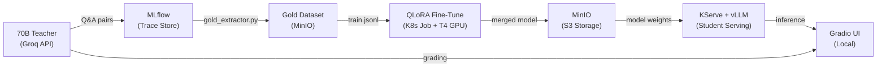
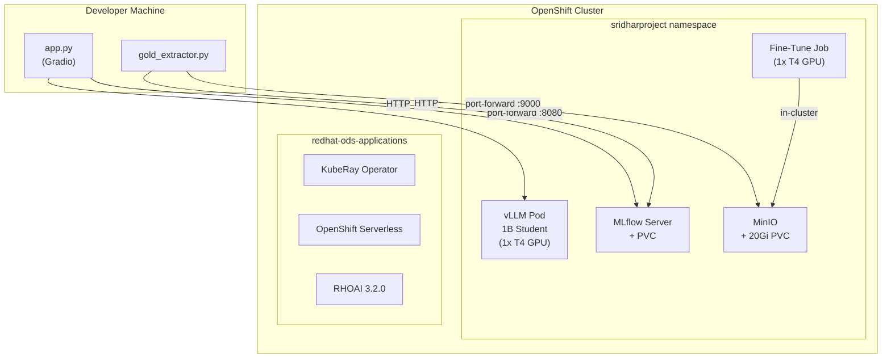
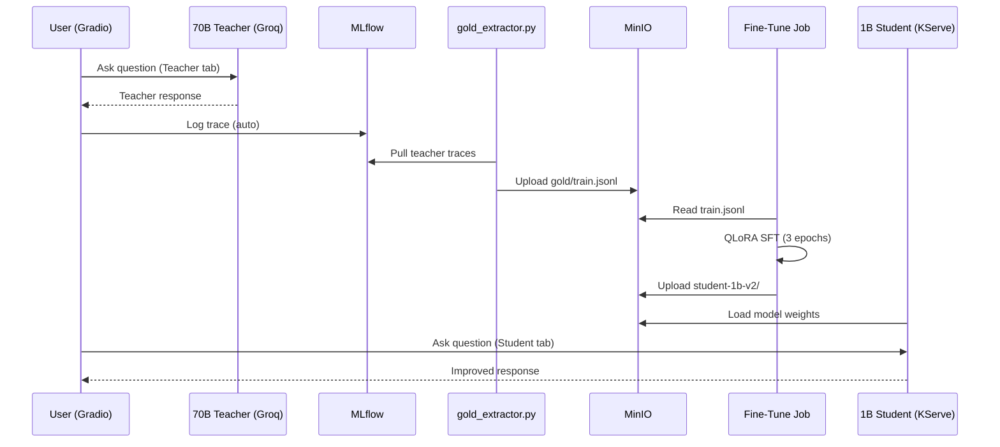

# 70B → 1B Knowledge Distillation on RHOAI

**Cluster:** OpenShift + RHOAI 3.2.0 | **Namespace:** `sridharproject`

---

## End-to-End Pipeline



---

## Cluster Architecture



---

## Distillation Loop



---

## MinIO Bucket Layout

```
sridhar-models/
├── student-1b-merged/       # Original student (Sprint 1)
│   ├── model.safetensors
│   ├── tokenizer.json
│   └── config.json
├── student-1b-v2/           # Fine-tuned student (Sprint 4)
│   ├── model.safetensors
│   ├── tokenizer.json
│   └── config.json
└── training-code/
    └── finetune.py

mlflow-artifacts/
├── gold/
│   └── train.jsonl           # 10 teacher Q&A pairs
└── 1/
    └── traces/               # MLflow experiment traces
```

---

## Key Commands

**Start the local app** (needs two port-forwards in separate terminals):

```bash
# Terminal 1 — forward vLLM
oc port-forward svc/student-llm-predictor 8080:80 -n sridharproject

# Terminal 2 — forward MinIO (for MLflow artifacts)
oc port-forward svc/minio 9000:9000 -n sridharproject

# Terminal 3 — run the app
cd ~/AgentBuilder && source venv311/bin/activate
AWS_ACCESS_KEY_ID=minioadmin AWS_SECRET_ACCESS_KEY=minioadmin123 \
  MLFLOW_S3_ENDPOINT_URL=http://localhost:9000 \
  STUDENT_ENDPOINT=http://localhost:8080/v1 \
  python app.py
```

**Extract gold data from MLflow traces:**

```bash
source venv311/bin/activate
AWS_ACCESS_KEY_ID=minioadmin AWS_SECRET_ACCESS_KEY=minioadmin123 \
  MLFLOW_S3_ENDPOINT_URL=http://localhost:9000 \
  python gold_extractor.py
```

**Run fine-tuning on cluster:**

```bash
# Update the script ConfigMap and submit the job
oc delete configmap finetune-script -n sridharproject
oc create configmap finetune-script --from-file=finetune.py -n sridharproject
oc apply -f rhoai/04-rayjob-finetune.yaml

# Monitor
oc logs -f $(oc get pods -n sridharproject -l job-name=student-finetune-v2 \
  -o jsonpath='{.items[0].metadata.name}') -n sridharproject
```

**Check cluster health:**

```bash
oc get pods -n sridharproject
oc get inferenceservice -n sridharproject
oc get routes -n sridharproject
```

---

## Tech Stack

| Component | Tool | Location |
|---|---|---|
| Teacher LLM | Llama-3.3-70B via Groq API | Cloud (Groq) |
| Student LLM | Llama-3.2-1B-Instruct | KServe + vLLM on OpenShift |
| Fine-Tuning | QLoRA + SFTTrainer (trl) | K8s Job with T4 GPU |
| Tracking | MLflow 3.10 | Pod in sridharproject |
| Storage | MinIO (S3-compatible) | Pod in sridharproject |
| UI | Gradio 6.x | Local (developer machine) |
| Cluster | OpenShift + RHOAI 3.2.0 | AWS (g4dn.12xlarge) |
