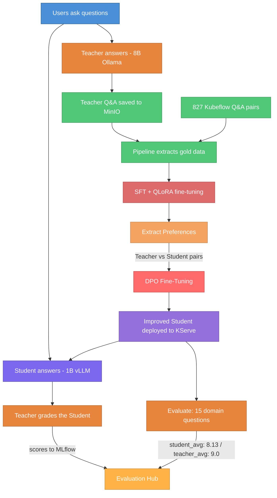

# Knowledge Distillation: Making AI Smaller, Smarter, and Cheaper

**Project:** LLM-to-SLM Distillation PoC on Red Hat OpenShift AI
**Author:** Sridhar Pillai | **Platform:** Red Hat OpenShift AI (RHOAI) 3.2.0
**Jira:** [RHOAIENG-51416](https://redhat.atlassian.net/browse/RHOAIENG-51416) | **GitHub:** [Sridhar1030/AgentBuilder](https://github.com/Sridhar1030/AgentBuilder)

---

## The Problem

Large Language Models (LLMs) like Meta's Llama 3.3 70B are highly capable but expensive to run — they require multiple GPUs, consume significant compute, and are slow to respond. For enterprise use cases where cost and latency matter, serving a 70B model at scale is impractical.

**A Real-World Scenario:** Imagine a large healthcare network processing 50,000 patient portal messages daily. Deploying a massive 70B model to read, categorize, and route these messages to the correct departments would require expensive, dedicated GPU clusters costing tens of thousands of dollars monthly. The vast majority of these messages — prescription refills, appointment scheduling — don't need deep diagnostic reasoning. They simply need fast, secure, and accurate routing.

**The question:** Can we transfer the knowledge of a large model into a small 1B model — making it nearly as smart but dramatically cheaper to run?

---

## Why Small Language Models Outperform LLMs on Specific Tasks

Massive LLMs are not always the best tool for the job. For structured tasks like API orchestration, tool calling, or deterministic formatting, highly trained Small Language Models (SLMs) frequently outperform generalist LLMs. By aggressively fine-tuning SLMs for targeted behaviors, they avoid verbose overgeneralization and deliver cleaner outputs, strict schema adherence, and fewer hallucinations.

This architectural advantage is backed by recent research:
- **Small Language Models are the Future of Agentic AI** — Concludes that SLMs deliver higher reliability and lower latency for the repetitive, scoped subtasks required in modular agent architectures.
- **Small Language Models for Efficient Agentic Tool Calling** — Demonstrates that task-specific optimization beats sheer scale. A highly specialized 350M parameter SLM drastically outperformed massive models like ChatGPT and Claude on tool-calling evaluations.
- **On-Policy Distillation** — Highlights how frameworks like Generalized Knowledge Distillation allow SLMs to learn interactively from teacher feedback rather than static data, creating highly accurate models tailored to specific domains.

---

## The Approach: Teacher-Student Distillation

The idea is simple: a large "Teacher" model teaches a small "Student" model how to answer questions well.

- **Teacher** — Llama 3.1 8B Instruct (hosted in-cluster via Ollama). Capable enough to guide the Student, fully self-contained with no external API dependencies.
- **Student** — Llama 3.2 1B (hosted on OpenShift via KServe + vLLM). Small, fast, cheap — but initially not very smart.

**How it works:**

1. Users ask questions through a Gradio chat interface
2. The Teacher answers questions, and these high-quality responses are logged as "gold data"
3. The Student is fine-tuned on this gold data using **SFT (Supervised Fine-Tuning)** with QLoRA — the standard approach for distilling instruct models, done memory-efficiently on a single GPU
4. The Teacher and Student answer the same questions; where the Teacher scores higher, those pairs become **preference data**
5. The Student is further refined using **DPO (Direct Preference Optimization)** — learning to prefer the Teacher's style of answer over its own weaker attempts
6. The improved Student is deployed and the Teacher grades its new answers
7. This cycle repeats — each iteration, the Student gets smarter

This is the **Distillation Flywheel** — a self-improving loop that combines SFT (learn *what* to say) with DPO (learn *how* to say it better).

**Domain focus:** The PoC specializes the Student on Kubeflow and AI/ML concepts (Kubeflow Pipelines, Training Operator, KServe, knowledge distillation, LoRA, QLoRA). This demonstrates that a 1B model can become a domain expert through targeted distillation — the same approach enterprises use to build on-prem assistants for product docs, internal knowledge bases, or customer support.

---

## What Was Built

### Interactive Chat App

A Gradio-based web interface where users can talk to either the Teacher or the Student. The app implements two distinct data paths:

- **Teacher path** — Responses are written directly to MinIO (`teacher-interactions/`) as individual JSON objects for pipeline consumption. No MLflow tracing — zero overhead on the training data path.
- **Student path** — Each interaction produces a 3-level MLflow trace (`student_interaction` → `student_inference` + `teacher_assessment`), an MLflow Assessment with the teacher's grade (LLM-as-Judge), and a chartable run metric (`teacher_score`) for tracking quality over time.

### Automated 7-Step Pipeline (SFT + DPO)

The entire distillation cycle runs as a single automated pipeline on OpenShift AI:

1. **Resolve Version** — Auto-numbers each training cycle (v30, v31, v32...)
2. **Extract Gold Data** — Reads Teacher interactions from MinIO, merges 827 Kubeflow-specific synthetic Q&A pairs, writes combined gold JSONL
3. **SFT Fine-Tune** — Trains the Student on gold data using QLoRA on a single T4 GPU via Kubeflow TrainJob (TrainJob CRD)
4. **Extract Preferences** — Both Student and Teacher answer the same questions; where the Teacher scores higher, those become preference pairs (prompt, chosen, rejected)
5. **DPO Fine-Tune** — Refines the SFT model using DPOTrainer on preference pairs, teaching it to prefer better answers over its own weaker attempts
6. **Deploy** — Hot-swaps the live Student model on KServe with zero downtime
7. **Evaluate** — Benchmarks the Student against the Teacher on 15 domain questions (Kubeflow Pipelines, Training Operator, KServe, Katib, multi-tenancy), logs comparison metrics to MLflow

### Synthetic Data Generator

A standalone script (`scripts/generate_synthetic_gold.py`) that produces high-quality Q&A pairs on demand using the Teacher model. Output is date-partitioned in MinIO (`synthetic/date=YYYY-MM-DD/`), automatically merged by the pipeline's extract step. The current training set includes 827 Kubeflow-specific Q&A pairs generated from Kubeflow docs, GitHub repos, release notes, and YouTube transcripts.

### Evaluation Hub (MLflow)

All evaluation data flows into the `Distillation-Eval-Hub` MLflow experiment:

- **Pipeline benchmark runs** (`pipeline-eval-vN`) — Student vs Teacher scores on the same questions, with `student_avg_score`, `teacher_avg_score`, and `score_gap` metrics. Compare across versions to chart improvement.

(**ADD IMAGE**)

- **Per-turn traces** — Every student interaction through the Gradio UI is traced with latency breakdown, teacher grade, and assessment metadata.
- **Artifacts** — `eval_results.json` per pipeline run with full per-question answers from both models, enabling qualitative review.

### Kubernetes Operator

A custom operator that makes triggering the pipeline as simple as applying a YAML file:

```
oc apply -f distillationjob.yaml → Pipeline runs automatically
```

No manual intervention needed. The operator watches for requests, triggers the pipeline, and reports status back.

---

## Components Used


| Component                        | Role                                                                                          |
| -------------------------------- | --------------------------------------------------------------------------------------------- |
| **Red Hat OpenShift AI**         | Platform for all ML workloads                                                                 |
| **KServe + vLLM**                | Serves the Student model (Llama 3.2 1B) as a high-performance REST API                       |
| **Ollama (in-cluster)**          | Hosts the Teacher model (Llama 3.1 8B Instruct) on-cluster — no external API dependencies    |
| **MinIO**                        | On-cluster S3-compatible storage for models, training data, and preference pairs              |
| **MLflow**                       | Evaluation hub — traces, assessments, benchmark metrics, and artifact storage                 |
| **Data Science Pipelines (KFP v2)** | Orchestrates the 7-step SFT+DPO distillation pipeline                                     |
| **SFT + QLoRA**                  | Supervised Fine-Tuning with 4-bit quantized LoRA — learns from gold Q&A data                 |
| **DPO (Direct Preference Optimization)** | Aligns model output by learning from Teacher vs Student preference pairs              |
| **Kubeflow Training Operator v2** | Manages GPU training jobs via TrainJob CRD (`trainer.kubeflow.org/v1alpha1`)                 |
| **Custom Kubernetes Operator**   | One-click pipeline triggering via DistillationJob CRD                                         |
| **Gradio**                       | Chat UI for interacting with Teacher and Student models                                       |


---

## Benchmark Results

### Phase 1 Baseline — SFT Only (v21)

| Metric              | Score        |
| ------------------- | ------------ |
| Student Average     | **5.4/10**   |
| Teacher Average     | 9.8/10       |
| Score Gap           | 4.4          |

The Student handled general topics well but failed on specialized concepts it hadn't seen enough training data for.

### Phase 2 — SFT + DPO (v32)

After adding 827 Kubeflow-specific synthetic Q&A pairs, preference extraction, and DPO fine-tuning:

| Metric              | Score        |
| ------------------- | ------------ |
| Student Average     | **8.13/10**  |
| Teacher Average     | 9.0/10       |
| Score Gap           | **0.87**     |

**Improvement:** Student score jumped from **5.4 → 8.13** (+51%), and the gap with the Teacher shrank from **4.4 → 0.87** — demonstrating the flywheel effect. The combination of domain-specific SFT data and DPO alignment brought the 1B Student within striking distance of the 8B Teacher across Kubeflow Pipelines, Training Operator, KServe, Katib, and platform questions.

### Hardware

All training and inference runs on a single **AWS g4dn.12xlarge** node with **4× NVIDIA Tesla T4 GPUs** (15 GB VRAM each). QLoRA reduces memory requirements enough to fine-tune the 1B model on a single T4.

---

## Key Results

- **End-to-end SFT+DPO pipeline** — From raw training data to a deployed, DPO-aligned Student model in a single automated 7-step run
- **Student score: 5.4 → 8.13** — The distillation flywheel closed the quality gap from 4.4 to 0.87 points, demonstrating meaningful knowledge transfer from Teacher to Student
- **Fully self-contained** — Teacher model (Ollama 8B) runs in-cluster alongside the Student, with no external API dependencies
- **Two-stage training** — SFT teaches the Student *what* to say; DPO teaches it to *prefer* better answers, combining both for stronger alignment
- **Auto-versioning** — Each training cycle produces a versioned model (v30, v31, v32...), enabling rollback
- **Hot-swap deployment** — The live Student model is updated on KServe without downtime
- **Teacher-as-Judge evaluation** — Automated quality scoring after every training cycle, with per-question breakdowns logged to MLflow
- **Real-time grading** — Every student interaction in the Gradio UI is graded by the Teacher, with scores logged as MLflow Assessments (LLM-as-Judge) and chartable run metrics
- **Kubernetes-native** — Everything runs on OpenShift, triggered by standard `oc apply` commands via a custom Kubernetes operator

---

## The Flywheel in One Picture



Each cycle, the 1B Student closes the gap with the 8B Teacher — delivering better answers at a fraction of the cost.

---

## Remaining Challenges / Next Steps

### Solved in Phase 2

- ~~**Teacher dependency**~~ — The Teacher now runs in-cluster via Ollama (Llama 3.1 8B). No external API dependencies.
- ~~**Limited training data**~~ — 827 Kubeflow-specific synthetic Q&A pairs now provide domain coverage. Student score improved from 5.4 to 8.13.
- ~~**Single training method**~~ — Pipeline now combines SFT (learn from gold data) and DPO (learn from preference pairs) for stronger alignment.

### Still Open

- **Automated quality gate** — The pipeline deploys every fine-tuned model regardless of evaluation scores. A quality threshold should block deployment if the new model scores worse than the previous version.
- **Canary deployment and rollback** — Today the pipeline does a full model swap. A safer approach would split traffic (e.g. 80/20 old/new), compare performance, and only roll forward when the new model proves better.
- **Richer evaluation** — The Teacher-as-Judge approach gives a single 1-10 score. More rigorous evaluation (factual accuracy, hallucination detection, domain-specific benchmarks) would provide stronger confidence in model quality.
- **Cost tracking** — There is no visibility into the cost per training cycle (GPU hours, storage). Adding cost metrics would help determine when the distillation ROI plateaus.
- **Multi-domain generalization** — The Student is currently specialized on Kubeflow. Extending to additional enterprise domains (product docs, customer support) would demonstrate broader applicability.
- **Iterative flywheel demonstration** — Running multiple consecutive pipeline cycles and charting `score_gap` across versions (v32 → v33 → v34) would demonstrate the flywheel effect more visibly.

