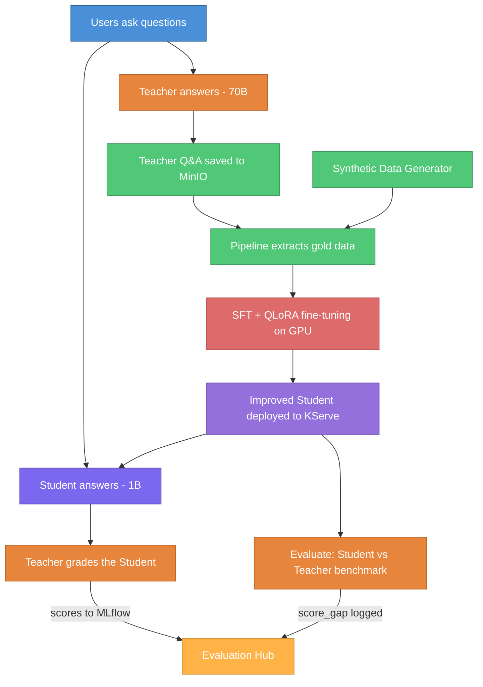

# Knowledge Distillation: Making AI Smaller, Smarter, and Cheaper

**Project:** LLM-to-SLM Distillation PoC on Red Hat OpenShift AI
**Author:** Sridhar Pillai | **Platform:** Red Hat OpenShift AI (RHOAI) 3.2.0

---

## The Problem

Large Language Models (LLMs) like Meta's Llama 3.3 70B are highly capable but expensive to run — they require multiple GPUs, consume significant compute, and are slow to respond. For enterprise use cases where cost and latency matter, serving a 70B model at scale is impractical.

**The question:** Can we transfer the knowledge of a large 70B model into a small 1B model — making it nearly as smart but 70x cheaper to run?

---

## The Approach: Teacher-Student Distillation

The idea is simple: a large "Teacher" model teaches a small "Student" model how to answer questions well.

- **Teacher** — Llama 3.3 70B (hosted externally via Groq API). Highly capable, expensive to serve.
- **Student** — Llama 3.2 1B (hosted on OpenShift via KServe). Small, fast, cheap — but initially not very smart.

**How it works:**

1. Users ask questions through a Gradio chat interface
2. The Teacher answers questions, and these high-quality responses are logged as "gold data"
3. The Student is fine-tuned on this gold data using SFT (Supervised Fine-Tuning) with QLoRA — the standard approach for distilling instruct models, done memory-efficiently on a single GPU
4. The improved Student is deployed and the Teacher grades its new answers
5. This cycle repeats — each iteration, the Student gets smarter

This is the **Distillation Flywheel** — a self-improving loop where the Teacher continuously trains the Student.

**Domain focus:** The PoC specializes the Student on AI/ML concepts (knowledge distillation, LoRA, QLoRA, model compression, inference optimization). This demonstrates that a 1B model can become a domain expert through targeted distillation — the same approach enterprises use to build on-prem assistants for product docs, internal knowledge bases, or customer support.

---

## What Was Built

### Interactive Chat App

A Gradio-based web interface where users can talk to either the Teacher or the Student. The app implements two distinct data paths:

- **Teacher path** — Responses are written directly to MinIO (`teacher-interactions/`) as individual JSON objects for pipeline consumption. No MLflow tracing — zero overhead on the training data path.
- **Student path** — Each interaction produces a 3-level MLflow trace (`student_interaction` → `student_inference` + `teacher_assessment`), an MLflow Assessment with the teacher's grade (LLM-as-Judge), and a chartable run metric (`teacher_score`) for tracking quality over time.

### Automated 5-Step Pipeline

The entire distillation cycle runs as a single automated pipeline on OpenShift AI:

1. **Resolve Version** — Auto-numbers each training cycle (v19, v20, v21...)
2. **Extract Gold Data** — Reads new Teacher interactions from MinIO incrementally (cursor-based), merges synthetic data from `synthetic/`, writes combined gold JSONL
3. **Fine-Tune** — Trains the Student on gold data using SFT with QLoRA on a single T4 GPU via Kubeflow TrainJob
4. **Deploy** — Hot-swaps the live Student model on KServe with zero downtime
5. **Evaluate** — Benchmarks the Student against the Teacher on a fixed set of domain questions, logs comparison metrics and full results to MLflow

### Synthetic Data Generator

A standalone script (`scripts/generate_synthetic_gold.py`) that produces high-quality Q&A pairs on demand using the 70B Teacher via Groq. Output is date-partitioned in MinIO (`synthetic/date=YYYY-MM-DD/`), automatically merged by the pipeline's extract step. This enables scaling training data without requiring manual user traffic.

### Evaluation Hub (MLflow)

All evaluation data flows into the `Distillation-Eval-Hub` MLflow experiment:

- **Pipeline benchmark runs** (`pipeline-eval-vN`) — Student vs Teacher scores on the same questions, with `student_avg_score`, `teacher_avg_score`, and `score_gap` metrics. Compare across versions to chart improvement.

(**ADD IMAGE**)

- **Per-turn traces** — Every student interaction through the Gradio UI is traced with latency breakdown, teacher grade, and assessment metadata.
- **Artifacts** — `eval_results.json` per pipeline run with full per-question answers from both models, enabling qualitative review.

### Kubernetes Operator

A custom operator that makes triggering the pipeline as simple as applying a YAML file:

```
oc apply -f distillationjob.yaml → Pipeline runs automatically
```

No manual intervention needed. The operator watches for requests, triggers the pipeline, and reports status back.

---

## Components Used


| Component                        | Role                                                                                          |
| -------------------------------- | --------------------------------------------------------------------------------------------- |
| **Red Hat OpenShift AI**         | Platform for all ML workloads                                                                 |
| **KServe + vLLM**                | Serves the Student model as a high-performance REST API                                       |
| **Groq API**                     | Hosts the 70B Teacher model externally                                                        |
| **MinIO**                        | On-cluster object storage for models, teacher interactions, synthetic data, and training gold |
| **MLflow**                       | Evaluation hub — traces, assessments, benchmark metrics, and artifact storage                 |
| **Data Science Pipelines (KFP)** | Orchestrates the 5-step distillation pipeline                                                 |
| **SFT + QLoRA**                  | Supervised Fine-Tuning with quantized LoRA — trains on a single GPU                           |
| **Kubeflow Trainer**             | Manages GPU training jobs via TrainJob CRs                                                    |
| **Custom Kubernetes Operator**   | One-click pipeline triggering via YAML                                                        |


---

## Benchmark Results (v21)

The pipeline's evaluate step benchmarks the Student against the Teacher on 5 AI/ML domain questions. Results from the latest completed run:


| Question                     | Student    | Teacher    | Gap     |
| ---------------------------- | ---------- | ---------- | ------- |
| Knowledge distillation       | 9/10       | 10/10      | 1       |
| LoRA vs full fine-tuning     | 6/10       | 9/10       | 3       |
| QLoRA memory reduction       | 1/10       | 10/10      | 9       |
| Small model advantages       | 9/10       | 10/10      | 1       |
| Teacher model in compression | 2/10       | 10/10      | 8       |
| **Average**                  | **5.4/10** | **9.8/10** | **4.4** |


**What this tells us:** The Student already handles general topics well (Q1, Q4) but fails on specialized concepts it hasn't seen enough training data for (QLoRA, teacher-student dynamics). With targeted synthetic data on these weak spots and additional pipeline cycles, the score gap is expected to shrink significantly — demonstrating the flywheel effect.

---

## Key Results

- **End-to-end pipeline runs successfully** — From raw Teacher interactions to a deployed, evaluated Student model in a single automated run (~5 minutes)
- **Student vs Teacher comparison** — Every pipeline cycle benchmarks both models on the same questions and logs `student_avg_score`, `teacher_avg_score`, and `score_gap` to MLflow for cross-version comparison
- **Auto-versioning** — Each training cycle produces a versioned model (v19, v20, v21...), enabling rollback
- **Hot-swap deployment** — The live Student model is updated on KServe without downtime
- **Real-time grading** — Every student interaction in the Gradio UI is graded by the Teacher, with scores logged as MLflow Assessments (LLM-as-Judge) and chartable run metrics
- **Incremental data pipeline** — Teacher interactions are consumed incrementally via cursor, synthetic data is merged automatically, no data is reprocessed
- **Kubernetes-native** — Everything runs on OpenShift, triggered by standard `oc apply` commands

---

## The Flywheel in One Picture




Each cycle, the 1B Student closes the gap with the 70B Teacher — delivering better answers at a fraction of the cost.

---

## Next Steps

- **Scale training data** — Generate 100-200 targeted synthetic Q&A pairs on the weak topics (QLoRA, model compression, teacher-student dynamics) and run 2-3 more pipeline cycles to demonstrate the score gap shrinking across versions.
- **Automated quality gate** — Block deployment if the new model scores worse than the previous version. Compare `score_gap` of the current run against the last successful run before promoting.
- **Canary deployment and rollback** — Split traffic (e.g. 80/20 old/new), compare live performance, and only roll forward when the new model proves better.
- **Teacher dependency** — The 70B Teacher is hosted externally via Groq. For production, self-hosting the Teacher on-cluster would remove the third-party API dependency.
- **Richer evaluation** — Add factual accuracy checks, hallucination detection, and domain-specific benchmarks beyond the single LLM-as-Judge score.
- **Cost tracking** — Add metrics for GPU hours, API calls, and storage per training cycle to determine when the distillation ROI plateaus.

