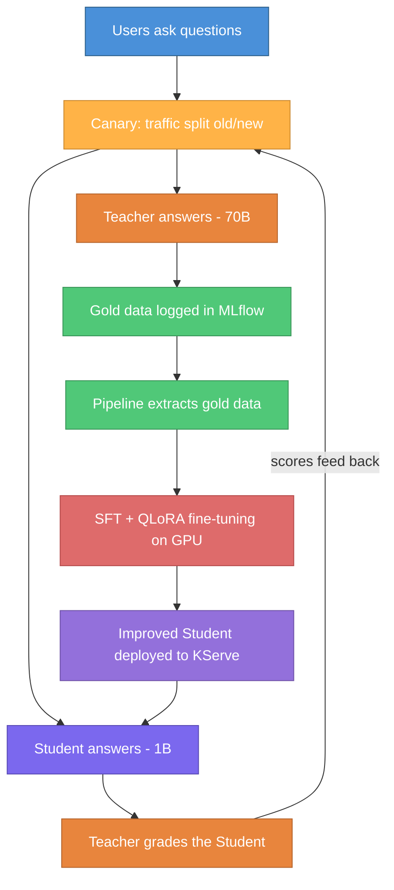

# Knowledge Distillation: Making AI Smaller, Smarter, and Cheaper

**Project:** LLM-to-SLM Distillation PoC on Red Hat OpenShift AI
**Author:** Sridhar Pillai | **Platform:** Red Hat OpenShift AI (RHOAI) 3.2.0

---

## The Problem

Large Language Models (LLMs) like Meta's Llama 3.3 70B are highly capable but expensive to run — they require multiple GPUs, consume significant compute, and are slow to respond. For enterprise use cases where cost and latency matter, serving a 70B model at scale is impractical.

**The question:** Can we transfer the knowledge of a large 70B model into a small 1B model — making it nearly as smart but 70x cheaper to run?

---

## The Approach: Teacher-Student Distillation

The idea is simple: a large "Teacher" model teaches a small "Student" model how to answer questions well.

- **Teacher** — Llama 3.3 70B (hosted externally via Groq API). Highly capable, expensive to serve.
- **Student** — Llama 3.2 1B (hosted on OpenShift via KServe). Small, fast, cheap — but initially not very smart.

**How it works:**

1. Users ask questions through a Gradio chat interface
2. The Teacher answers questions, and these high-quality responses are logged as "gold data"
3. The Student is fine-tuned on this gold data using SFT (Supervised Fine-Tuning) with QLoRA — the standard approach for distilling instruct models, done memory-efficiently on a single GPU
4. The improved Student is deployed and the Teacher grades its new answers
5. This cycle repeats — each iteration, the Student gets smarter

This is the **Distillation Flywheel** — a self-improving loop where the Teacher continuously trains the Student.

---

## What Was Built

### Interactive Chat App
A Gradio-based web interface where users can talk to either the Teacher or the Student. When the Student answers, the Teacher automatically grades the response (1-10 score). All interactions are tracked in MLflow.

### Automated 5-Step Pipeline
The entire distillation cycle runs as a single automated pipeline on OpenShift AI:

1. **Resolve Version** — Auto-numbers each training cycle (v6, v7, v8...)
2. **Extract Gold Data** — Pulls high-scoring Teacher answers from MLflow
3. **Fine-Tune** — Trains the Student on gold data using SFT with QLoRA on GPU
4. **Deploy** — Hot-swaps the live Student model with the improved version
5. **Evaluate** — Teacher grades the new Student and reports quality scores

### Kubernetes Operator
A custom operator that makes triggering the pipeline as simple as applying a YAML file:

```
oc apply -f distillationjob.yaml → Pipeline runs automatically
```

No manual intervention needed. The operator watches for requests, triggers the pipeline, and reports status back.

---

## Components Used

| Component | Role |
|---|---|
| **Red Hat OpenShift AI** | Platform for all ML workloads |
| **KServe** | Serves the Student model as a REST API |
| **vLLM** | High-performance inference engine for the Student |
| **Groq API** | Hosts the 70B Teacher model externally |
| **MinIO** | On-cluster object storage for models and training data |
| **MLflow** | Experiment tracking — logs every interaction and grade |
| **Data Science Pipelines (KFP)** | Orchestrates the 5-step distillation pipeline |
| **SFT + QLoRA** | Supervised Fine-Tuning with quantized LoRA — trains on a single GPU |
| **Kubeflow Trainer** | Manages GPU training jobs via TrainJob CRs — decouples training from pipeline orchestration |
| **Custom Kubernetes Operator** | One-click pipeline triggering via YAML |

---

## Key Results

- **End-to-end automation** — From raw Teacher interactions to a deployed, improved Student model in a single pipeline run
- **Auto-versioning** — Each training cycle produces a versioned model, enabling rollback
- **Hot-swap deployment** — The live Student model is updated without downtime
- **Teacher-as-Judge evaluation** — Automated quality scoring after every training cycle
- **Kubernetes-native** — Everything runs on OpenShift, triggered by standard `oc apply` commands

---

## The Flywheel in One Picture



Each cycle, the 1B Student closes the gap with the 70B Teacher — delivering better answers at a fraction of the cost.

---

## Remaining Challenges / Problems to Solve

- **Limited training data** — The Student is currently trained on a small set of Teacher interactions. Scaling to thousands of diverse, high-quality examples is needed to meaningfully close the quality gap.
- **No automated quality gate** — The pipeline deploys every fine-tuned model regardless of evaluation scores. A quality threshold should block deployment if the new model scores worse than the previous version.
- **Single-domain training** — Gold data is currently general-purpose Q&A. For enterprise use, the flywheel needs domain-specific data (e.g. product docs, internal knowledge) to produce a genuinely useful Student.
- **Canary deployment and rollback** — Today the pipeline does a full model swap. A safer approach would split traffic (e.g. 80/20 old/new), compare performance, and only roll forward when the new model proves better.
- **Teacher dependency** — The 70B Teacher is hosted externally via Groq. For production, this creates a dependency on a third-party API for both data generation and evaluation. Self-hosting the Teacher on-cluster would remove this.
- **Evaluation depth** — The Teacher-as-Judge approach gives a single 1-10 score. More rigorous evaluation (factual accuracy, hallucination detection, domain-specific benchmarks) would provide stronger confidence in model quality.
- **Cost tracking** — There is no visibility into the cost per training cycle (GPU hours, API calls, storage). Adding cost metrics would help determine when the distillation ROI plateaus.
